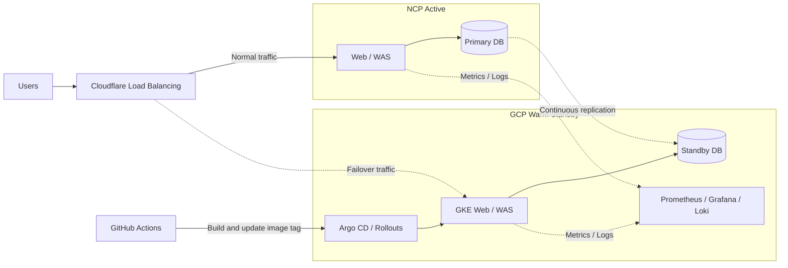

<div align="center">

# NCP-GCP Multi-Cloud DR Rebuild

### NCP Active와 GCP Warm Standby를 연결한 멀티클라우드 재해 복구 시스템

서비스와 데이터베이스의 장애 전환 과정을 자동화하고<br>
RTO·RPO·오류율·확장 시간·재구축 시간·비용을 실험으로 검증합니다


</div>

> [!IMPORTANT]
> 이 저장소는 현재 구현과 검증이 진행 중입니다. 아래 구성은 목표 아키텍처이며, 측정 결과는 동일 조건의 반복 실험이 끝난 뒤 증거 자료와 함께 공개합니다.

## Overview

기존 Team9 프로젝트에서 구현한 NCP-GCP Active-Standby 구조를 개인 프로젝트로 재설계합니다. 단순한 인프라 재현에 그치지 않고 장애 감지부터 트래픽 전환, 데이터베이스 승격, 애플리케이션 재연결, 부하 확장, Failback까지 하나의 DR 흐름으로 검증하는 것이 목표입니다.

기존 프로젝트는 NCP NKS를 Active, GCP GKE를 Standby로 구성했습니다. 이번 재구축에서는 NCP Active를 최소 구성으로 단순화하고 GCP Standby의 가용성·확장성·관측 가능성을 강화합니다. 모든 개선은 Before/After 조건에서 측정하여 설계 판단의 근거를 남깁니다.

## Problem Statement

멀티클라우드 환경을 구성했다는 사실만으로 재해 복구 능력이 증명되지는 않습니다.

- 장애 감지와 트래픽 전환에 실제로 얼마나 걸리는가
- 전환 중 사용자가 경험하는 오류는 몇 건인가
- Standby가 갑작스러운 전체 트래픽을 흡수할 수 있는가
- Primary DB 장애 시 데이터가 어디까지 복제되어 있는가
- Standby DB 승격 후 애플리케이션이 정상적으로 재연결되는가
- 장애 환경을 코드만으로 다시 만들 수 있는가
- 가용성을 위해 지불하는 대기 비용은 합리적인가

이 프로젝트는 위 질문을 재현 가능한 실험과 수치로 답하는 것을 목표로 합니다.

## Target Architecture



DB는 NCP VM의 MySQL 8.4 Primary에서 GCP Compute Engine의 MySQL 8.4 Standby로 GTID 기반 비동기 복제합니다. 설계 근거와 Failover·Failback 절차는 [ADR-001](docs/adr-001-database-topology.md)에 기록합니다. 검증되지 않은 Zero RPO나 Active-Active Multi-Writer를 전제로 하지 않습니다.

## Architecture Scope

| 영역 | 목표 구성 | 검증 관점 |
|---|---|---|
| NCP Active | VM, Docker Compose, Web·WAS·Primary DB | 장애 주입 대상과 평시 서비스 처리 |
| GCP Standby | GKE Standard, 멀티존 Node Pool, Web·WAS | 전환 트래픽 수용과 자동 확장 |
| Database DR | NCP MySQL Primary, GCP Compute Engine MySQL Standby | RPO·복제 지연·승격·Failback |
| Global Traffic | Cloudflare Load Balancing 기반 GSLB | 장애 감지와 단계적 트래픽 전환 |
| CI | GitHub Actions | 이미지 빌드와 GitOps 저장소 갱신 |
| CD | Argo CD, Argo Rollouts | Pull 기반 배포와 카나리 자동 제어 |
| Availability | Probe, PDB, Topology Spread | 장애 격리와 가용 Pod 유지 |
| Scaling | HPA, Cluster Autoscaler | 급격한 부하 증가 대응 |
| Observability | Prometheus, Grafana, Loki | 장애 중에도 유지되는 통합 관제 |
| Provisioning | Terraform, Ansible | 반복 가능한 생성과 구성 자동화 |
| Verification | k6, Failover Probe, DB 검증 스크립트 | 동일 조건의 Before/After 측정 |

## Application Baseline

| Layer | Source | Stack | DR Characteristic |
|---|---|---|---|
| Web | [greentech-web](https://github.com/Minter-v1/greentech-web) | Next.js 16, React 19, Node.js 24 | HTTP-only JWT 쿠키, 서버 메모리 세션 없음 |
| WAS | [greentech-was](https://github.com/Minter-v1/greentech-was) | Spring Boot 4, Java 21 | Stateless JWT 인증, Actuator Probe 지원 |
| Database | greentech-was Flyway Schema | MySQL 8.4, InnoDB, 25 Tables | Primary-Standby 복제와 승격 대상 |
| File Storage | greentech-was Attachment Module | Local 또는 S3 호환 Object Storage | DB 외부의 별도 DR 데이터 경로 |

상세 분석과 DR 적용 항목은 [Application Baseline](docs/application-baseline.md)에 기록합니다.

## Design Principles

### Active-Warm Standby

NCP가 평시 트래픽을 처리하고 GCP는 최소 용량으로 대기합니다. 장애가 감지되면 Cloudflare가 GCP로 트래픽을 전환하고, GKE는 HPA와 Cluster Autoscaler를 통해 필요한 처리 용량까지 확장합니다.

### Database-Aware Failover

서비스 전환 성공을 HTTP 응답만으로 판단하지 않습니다. Standby DB의 복제 상태를 확인하고 승격한 뒤 WAS의 연결 대상 전환과 읽기·쓰기 검증까지 완료되어야 전체 Failover가 성공한 것으로 판단합니다.

### Observability Outside the Failure Domain

장애 대상과 관제 시스템을 같은 환경에 두지 않습니다. 메트릭과 로그의 중심을 GCP Standby에 배치하여 NCP 장애 중에도 감지·전환·복구 과정을 관측할 수 있도록 설계합니다.

### GitOps Delivery

CI는 이미지를 빌드하고 선언된 이미지 태그를 갱신합니다. 클러스터 내부의 Argo CD가 변경사항을 가져가는 Pull 방식을 사용하여 외부 CI에 과도한 클러스터 권한을 부여하지 않습니다.

### Measurable Recovery

구축 여부가 아니라 복구 결과를 평가합니다. 모든 핵심 시나리오는 동일한 조건으로 반복하고 중앙값과 실험 설정을 함께 기록합니다.

## Success Metrics

| KPI | 정의 | 단위 |
|---|---|---|
| Service RTO | 장애 주입부터 GCP 애플리케이션의 첫 정상 응답까지 걸린 시간 | 초 |
| Database RTO | Primary DB 장애부터 Standby 승격과 정상 쿼리까지 걸린 시간 | 초 |
| RPO | 장애 시점과 Standby에 반영된 마지막 트랜잭션의 차이 | 초·트랜잭션 |
| Replication Lag | Primary 변경이 Standby에 반영되기까지 걸린 시간 | 초 |
| Failover Error Rate | 전환 구간 전체 요청 중 실패·타임아웃 비율 | % |
| Scale-Out Time | 부하 급증부터 목표 Pod가 Ready가 되기까지 걸린 시간 | 초 |
| Rebuild Time | 빈 환경에서 Standby 서비스가 응답하기까지 걸린 시간 | 분 |
| Standby Cost | 대기 상태의 예상 월 비용 | KRW·USD |

## Validation Scenarios

| ID | 시나리오 | 검증 항목 |
|---|---|---|
| S0 | 기준 용량 탐색 | 최대 처리량, p95 응답 시간, 이후 실험 부하 기준 |
| S1 | NCP 전체 장애와 GCP 전환 | Service RTO, 오류율, 응답 주체 전환 |
| S2 | 전환 직후 부하 급증 | Pod·Node 확장 시간, 확장 중 오류율 |
| S3 | 오류 버전 카나리 배포 | 자동 중단 시간, 오류 노출 요청 수 |
| S4 | Standby 전체 재구축 | Terraform·Ansible·Argo CD 기반 재구축 시간 |
| S5 | DB 장애와 Standby 승격 | Database RTO, RPO, 복제 지연, 데이터 유실량 |
| S6 | 서비스 정상화와 Failback | 재동기화 시간, 역할 복구, 쓰기 정합성 |

## Before vs After

| 구분 | Before | After |
|---|---|---|
| 전환 방식 | DNS 기반 즉시 100% 전환 | 헬스체크와 단계적 가중치 전환 |
| GCP 용량 | 고정 Replica와 단일 Node 중심 | HPA·여유 Pod·멀티존 Node Pool |
| 가용성 | Probe·PDB 부재 | Readiness·Liveness·PDB·Topology Spread |
| 배포 | 외부 CI의 직접 배포 | Argo CD Pull 기반 GitOps |
| 카나리 | 수동 Pause와 Weight 조절 | 메트릭 기반 자동 분석과 중단 |
| 관제 | 장애 대상 환경에 의존 | GCP Standby의 통합 관제 허브 |
| Database | 복제·승격 검증 부재 | 지속 복제·승격·재연결·Failback 검증 |
| 평가 방식 | 구성과 시연 중심 | 반복 실험과 정량 KPI 중심 |

## Repository Structure

```text
.
├── docs/                   # 아키텍처 결정과 실험 결과
├── gitops/
│   ├── base/               # 공통 Kubernetes 리소스
│   ├── before/             # 개선 전 비교 환경
│   └── after/              # 개선 후 목표 환경
├── infra/
│   ├── ansible/            # NCP VM 구성 자동화
│   └── terraform/
│       ├── gcp/            # GCP Standby 인프라
│       └── ncp/            # NCP Active 인프라
├── observability/          # Prometheus·Grafana·Loki
├── scripts/                # 구축·측정·정리 자동화
└── tests/
    ├── failover-probe/     # RTO와 응답 주체 측정
    └── k6/                 # 부하 테스트
```

애플리케이션 소스와 DB 스키마는 기존 프로젝트 자산을 활용합니다. 이 저장소에서는 인프라 코드, 배포 선언, 복제 구성, 측정 도구와 검증 결과를 관리합니다.

## Execution Strategy

| Phase | 산출물 |
|---|---|
| Baseline | 기존 한계를 재현한 Before 환경과 기준 측정값 |
| Infrastructure | NCP Active와 GCP Standby IaC |
| Database DR | 초기 동기화, 지속 복제, 승격과 Failback 절차 |
| Delivery | GitHub Actions, Argo CD, Argo Rollouts |
| Resilience | Probe, PDB, HPA, Topology Spread, Node Autoscaling |
| Observability | 통합 대시보드와 장애 구간 로그·메트릭 |
| Verification | 반복 가능한 부하·장애·재구축 실험 결과 |
| Portfolio | 아키텍처 결정, Before/After 수치, 비용 분석 |
